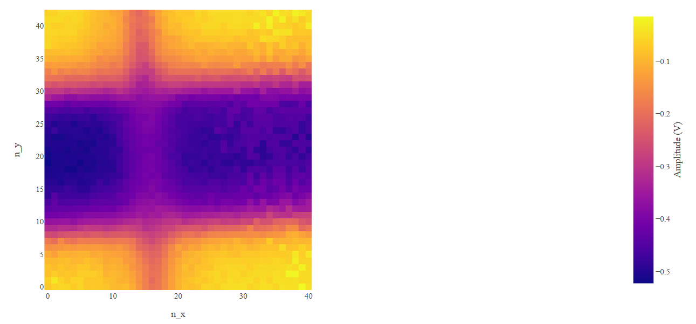

# TCT_Analysis_UZH_setup

This repo contains the code for the TCT Analysis of the TCT setup at UZH. This README is a guide to help you to run the analysis.

The software of the TCT setup and the code for the analysis was originally made for Ti-LGAD TCT measurements. The code was then also adapted for the analysis of TCT measurements on CASSIA sensors.

The measured data is saved in sqlite format and the (x,y) positions of the 2D scans in the pickle format.

## Ti-LGAD ANALYSIS

Two versions of the python code are available depending on how the analysis was performed. 

### V2 VERSION

This script should run for the analysis for data taken around the interpad region in the same configuration than on the 2D amplitude plot given below. 

This is the original verions of the code and has not been tested yet.

#### Usage

The path of to the measured data has to adapted in the form "C:/User/path_to_folder_with_Analysis_2.py/Data/name_of_device/voltages".

The required methods to be used has to be uncommented at the end of the script.

### V3 VERSION

This script runs for the analysis for data taken around the whole opening in the same configuration than on the 2D amplitude plot given below. 

#### Usage

The path of to the measured data has to adapted in the form "C:/User/path_to_folder_with_Analysis_2.py/Data/name_of_device/voltages"

## CASSIA ANALYSIS